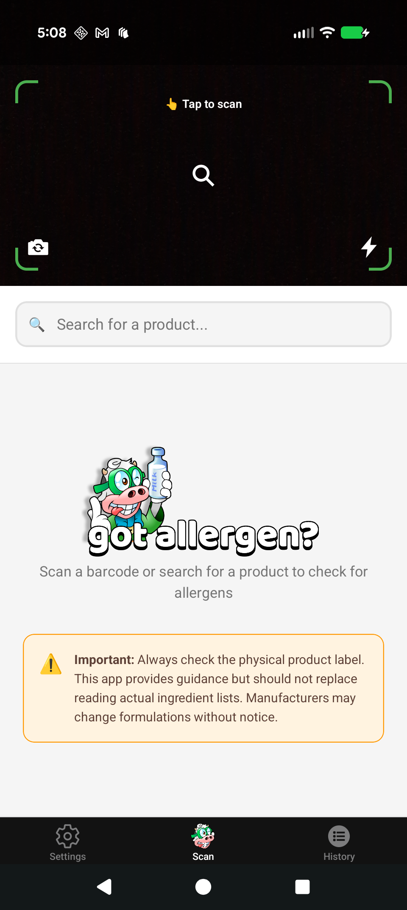
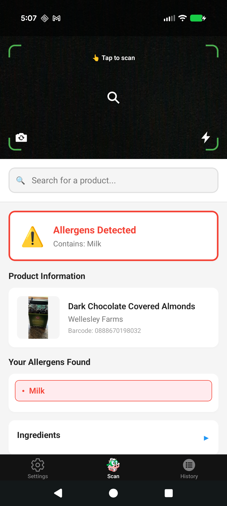
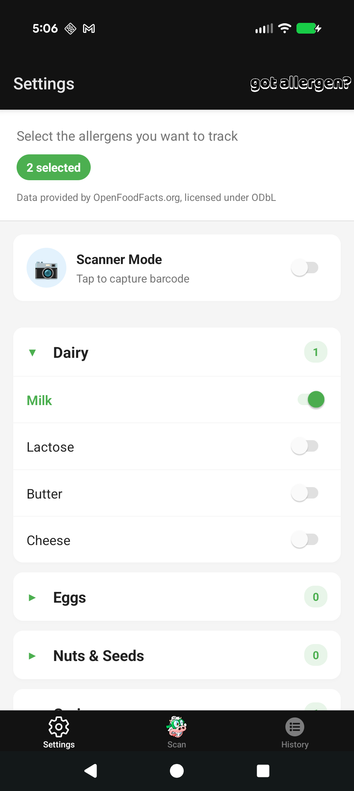
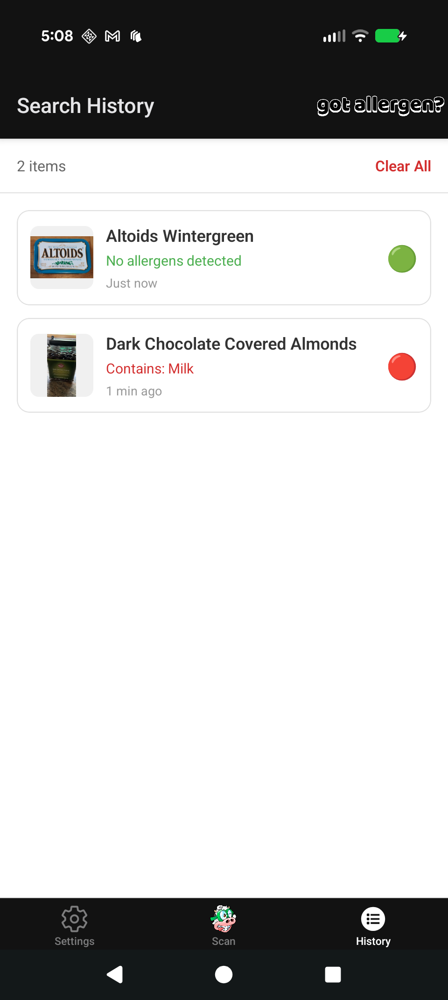

# Native Food Nutrition Scanner 🥫📱

A React Native app built with Expo that allows users to scan food product barcodes and retrieve detailed nutritional information using the OpenFoodFacts API.

## Features ✨

- **Barcode Scanning**: Real-time barcode scanning using device camera
- **Nutritional Information**: Detailed nutrition facts, ingredients, and allergen information
- **Product Search**: Search for products by name or barcode
- **Query History**: View previously searched products
- **Cross-Platform**: Runs on iOS, Android, and web
- **Dark Mode Support**: Automatic theme switching based on system preferences

## Screenshots 📸
   <div align="center">
      
      
      
      
   </div>

## Tech Stack 🛠️

- **Framework**: React Native with Expo SDK ~53.0.16
- **Language**: TypeScript
- **Navigation**: Expo Router (file-based routing)
- **Camera**: Expo Camera for barcode scanning
- **API**: OpenFoodFacts for product data
- **State Management**: React hooks and context
- **Styling**: React Native StyleSheet with theme support

## Supported Barcode Formats 📊

The app specifically targets food-related barcode formats:
- EAN13
- EAN8  
- UPC-A
- UPC-E

## Getting Started 🚀

### Prerequisites

- Node.js (v16 or higher)
- npm or yarn
- Expo CLI
- Android Studio (for Android development) or Xcode (for iOS development)

### Installation

1. **Clone the repository**
   ```bash
   git clone <repository-url>
   cd native-food-nutrition-scanner
   ```

2. **Install dependencies**
   ```bash
   npm install
   ```

3. **Start the development server**
   ```bash
   npm start
   # or
   expo start
   ```

4. **Run on your preferred platform**
   ```bash
   npm run android    # Android emulator/device
   npm run ios        # iOS simulator/device  
   npm run web        # Web browser
   ```

### Development Commands

| Command | Description |
|---------|-------------|
| `npm start` | Start Expo development server |
| `npm run dev` | Start with dev client |
| `npm run android` | Run on Android |
| `npm run ios` | Run on iOS |
| `npm run web` | Run in web browser |
| `npm run lint` | Run ESLint |
| `npm run clean` | Clean build artifacts |
| `npm run reset-project` | Reset to blank project |

## Project Structure 📁

```
native-food-nutrition-scanner/
├── app/                          # Expo Router screens
│   ├── (tabs)/                   # Tab navigation screens
│   │   ├── index.tsx            # Home screen
│   │   ├── productQuery.tsx     # Product search screen
│   │   └── previousQueries.tsx  # Query history screen
│   ├── _layout.tsx              # Root layout
│   └── +not-found.tsx           # 404 screen
├── src/
│   ├── api/                     # API integration
│   │   └── openFoodFacts.ts     # OpenFoodFacts API client
│   ├── components/              # Reusable components
│   │   ├── BarcodeScanner.tsx   # Camera barcode scanner
│   │   ├── ProductCard.tsx      # Product information display
│   │   ├── SearchBar.tsx        # Search input component
│   │   └── ui/                  # UI components
│   ├── hooks/                   # Custom React hooks
│   │   ├── useProductFetch.ts   # Product fetching logic
│   │   ├── useProductData.ts    # Product state management
│   │   └── useFlatListScroll.ts # List scrolling utilities
│   └── constants/               # App constants
│       └── Colors.ts            # Theme colors
├── assets/                      # Static assets
│   ├── images/                  # App icons and images
│   └── fonts/                   # Custom fonts
└── android/                     # Android-specific files
```

## Key Features Implementation 🔧

### Barcode Scanning
- Uses `expo-camera` for real-time barcode detection
- Filters for food-specific barcode formats
- Manual confirmation workflow for scanned codes

### Product Information
- Integrates with OpenFoodFacts API for comprehensive product data
- Displays nutrition facts, ingredients, allergens, and product images
- Handles missing data gracefully with fallback UI

### Navigation
- File-based routing with Expo Router
- Three-tab interface: Home, Product Query, Previous Queries
- Platform-specific styling for iOS and Android

### Theme Support
- Automatic dark/light mode detection
- Custom color schemes with platform-specific adaptations
- Consistent theming across all components

## API Integration 🌐

The app uses the [OpenFoodFacts API](https://world.openfoodfacts.org/data) to fetch product information:

- **Base URL**: `https://world.openfoodfacts.org/api/v0/`
- **Product Endpoint**: `/product/{barcode}.json`
- **Search Endpoint**: `/cgi/search.pl`

## Permissions 📋

### Required Permissions
- **Camera**: For barcode scanning functionality
- **Internet**: For API requests to fetch product data

Camera permission is requested when first accessing the scanner screen.

## Contributing 🤝

1. Fork the repository
2. Create a feature branch (`git checkout -b feature/amazing-feature`)
3. Commit your changes (`git commit -m 'Add amazing feature'`)
4. Push to the branch (`git push origin feature/amazing-feature`)
5. Open a Pull Request

### Development Guidelines
- Follow TypeScript best practices
- Use existing component patterns and styling conventions
- Add proper error handling for API calls
- Test on both iOS and Android platforms
- Run `npm run lint` before committing

## Troubleshooting 🔧

### Common Issues

**Camera not working on device:**
- Ensure camera permissions are granted
- Check that the device has a working camera
- Restart the Expo development server

**API requests failing:**
- Verify internet connection
- Check OpenFoodFacts API status
- Review network security settings on device

**Build errors:**
- Run `npm run clean` to clear build artifacts
- Delete `node_modules` and run `npm install`
- Check Expo CLI version compatibility

## License 📄

This project is licensed under the MIT License - see the [LICENSE](LICENSE) file for details.

## Acknowledgments 🙏

- [OpenFoodFacts](https://world.openfoodfacts.org/) for providing free access to product data
- [Expo](https://expo.dev/) for the excellent development platform
- React Native community for comprehensive documentation and support

## Roadmap 🗺️

- [ ] Offline support for scanned products
- [ ] Custom nutrition goals and tracking
- [ ] Product comparison features  
- [ ] Barcode history export
- [ ] Multi-language support
- [ ] Voice search functionality

---

**Built with ❤️ using React Native and Expo**